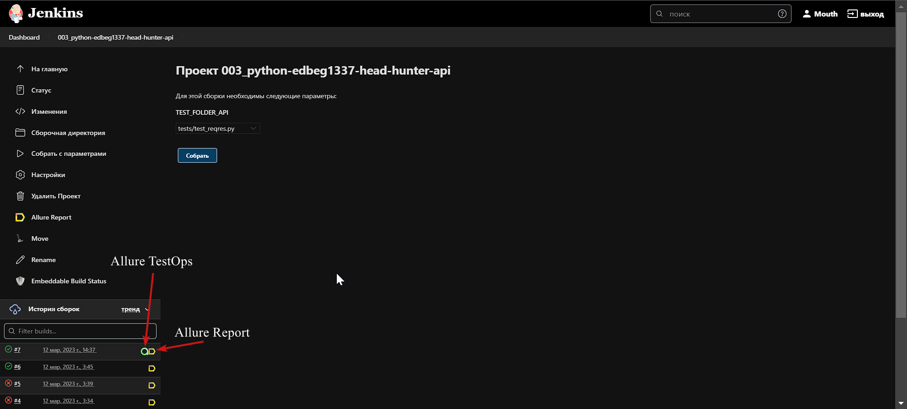

## Проект API автотестов hh.ru

<!-- Технологии -->

### Используемые технологии
<p  align="center">
  <code></code>
  <code></code>
  <code></code>
  <code></code>
  <code></code>
  <code></code>
  <code></code>
  <code></code>
  <code></code>
  <code></code>
  <code></code>


</p>


<!-- Тест кейсы -->

### Что проверяем
* Добавление товара и удаление ее из корзины
* Выход из аккаунта
* Добавление товара в корзину
* Вход с помощью логин/пароля
* Get users
* Get pages
* Post user


<!-- Jenkins -->

###  Запуск проекта в Jenkins

#### [Job](https://jenkins.autotests.cloud/job/003_python-edbeg1337-head-hunter-api/)

##### При нажатии на "Собрать с параметрами" откроеться окно где надо выбрать тесты которые запустяться через виртуальную машину в Selenide.




<!-- Allure report -->

###  Allure report
#### [Отчет в Allure](https://jenkins.autotests.cloud/job/003_python-edbeg1337-head-hunter-api/7/allure/)

##### После прохождения тестов, результаты можно посмотреть в Allure отчете, где так же содержится ссылка на Jenkins


##### Во вкладке Graphs можно посмотреть графики о прохождении тестов, по их приоритезации, по времени прохождения и др.


##### Во вкладке Suites находятся собранные тест кейсы, у которых описаны шаги и приложены логи.


##### Лог прохождение теста
````
INFO     root:base_session.py:37 302 curl -X POST -H 'Accept: */*' -H 'Accept-Encoding: gzip, deflate' -H 'Connection: keep-alive' -H 'Content-Length: 40' -H 'Content-Type: application/x-www-form-urlencoded' -H 'Cookie: ARRAffinity=fc06465c332dbd696c292ada76ec7d7733108ecefdc4475406a3ff997944f96b; ARRAffinitySameSite=fc06465c332dbd696c292ada76ec7d7733108ecefdc4475406a3ff997944f96b; NOPCOMMERCE.AUTH=47CCAF1B771DD2F1AF849E7AC95F787FD98513632DC49EF409BF169C158EFA341A611D38F161C986D36A8C03FDB55BFF11D60BE42D3D9DB5B8535F543201D59D425737533F8EF5682D95EF88067EDA9CDA8FAFE9DD91C5359A1C81ED39B63BFA4322EEF4457AEE8665103200079DAE0F364E50BFB114A104E7AF53E01BF77DBF80845CF737109C2680C43C85E7A0B6C6; Nop.customer=ffa7f14a-226a-4766-a1d8-b5b39b49fd71' -H 'User-Agent: python-requests/2.28.2' -d 'Email=test%40qa.guru.com&Password=123456' https://demowebshop.tricentis.com/login
INFO     root:base_session.py:37 302 curl -X GET -H 'Accept: */*' -H 'Accept-Encoding: gzip, deflate' -H 'Connection: keep-alive' -H 'Cookie: ARRAffinity=fc06465c332dbd696c292ada76ec7d7733108ecefdc4475406a3ff997944f96b; ARRAffinitySameSite=fc06465c332dbd696c292ada76ec7d7733108ecefdc4475406a3ff997944f96b; NOPCOMMERCE.AUTH=31908D1FFEF0FE602B3EAFE33C04123AED449BE4D420ED54F8FCC7775DE8BC8A3B20F3DC8FF1E00DA789A412758C68004AFDF310476CD8F46E677738C5387337DF47AE62DFFEEE7C52760914D4A6578EA69DC7AA349FB53970E9F6F89A20B1E7125722E8EAE2C93AEEAFF19F37D1664E4C31F1FC28ACEFCCF51922A98D01D99865C6A9896A6F300BCD62136EB5C8D25F; Nop.customer=ffa7f14a-226a-4766-a1d8-b5b39b49fd71' -H 'User-Agent: python-requests/2.28.2' https://demowebshop.tricentis.com/logout
````

<!-- Allure TestOps -->

###  Интеграция с Allure TestOps

#### [Dashboard](https://allure.autotests.cloud/project/2015/dashboards)

##### Так же вся отчетность сохраняется в Allure TestOps, где строятся аналогичные графики.


#### Во вкладке со сьютами, мы можем:
- Управлять всеми тест-кейсами или с каждым отдельно
- Перезапускать каждый тест отдельно от всех тестов
- Настроить интеграцию с Jira
- Добавлять ручные тесты и т.д


<!-- Jira -->

###  Интеграция с Jira
#### [Задача в JIRA](https://jira.autotests.cloud/browse/HOMEWORK-592)

##### Настроив через Allure TestOps интеграцию с Jira, в тикет можно пробросить результат прохождение тестов и список тест-кейсов из Allure


<!-- Telegram -->

###  Интеграция с Telegram
##### После прохождения тестов, в Telegram bot приходит сообщение с графиком и небольшой информацией о тестах.


